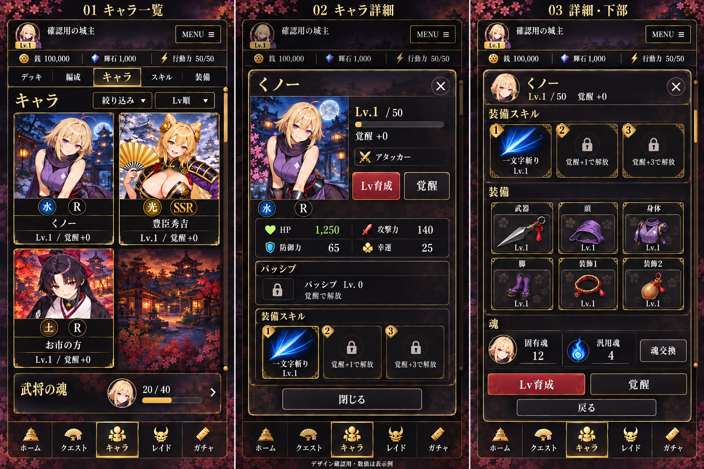
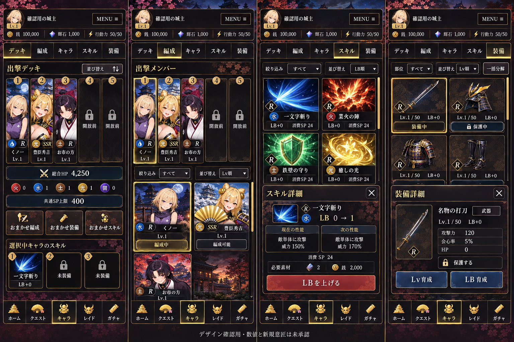
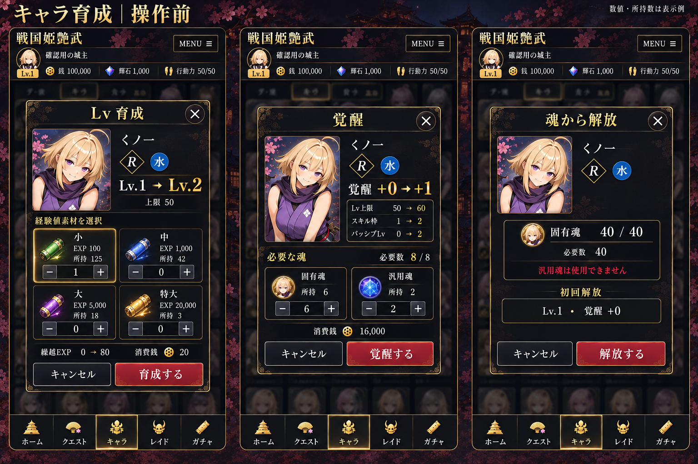
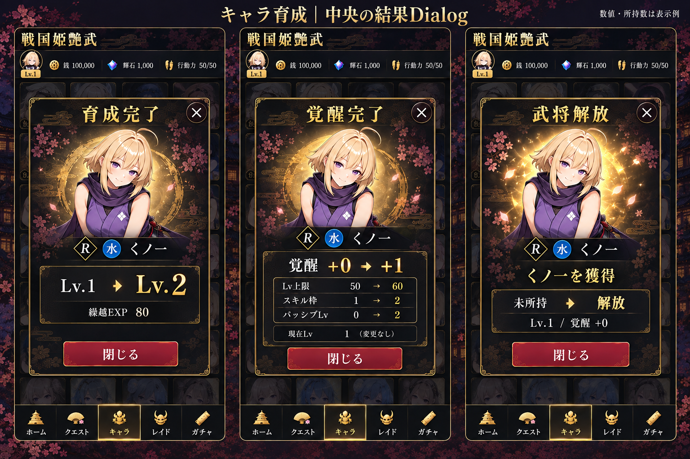
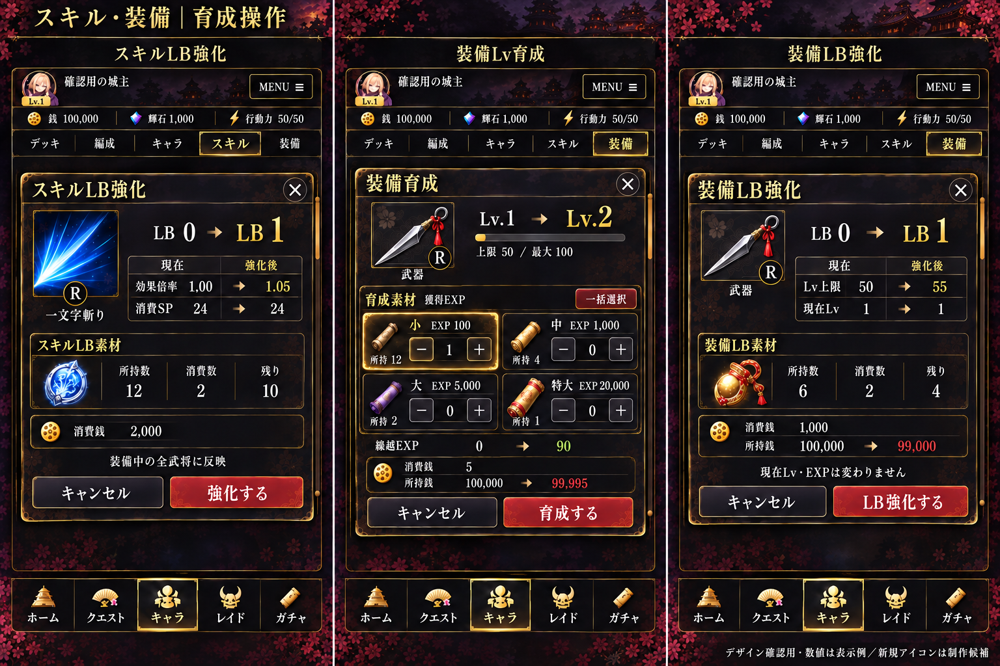
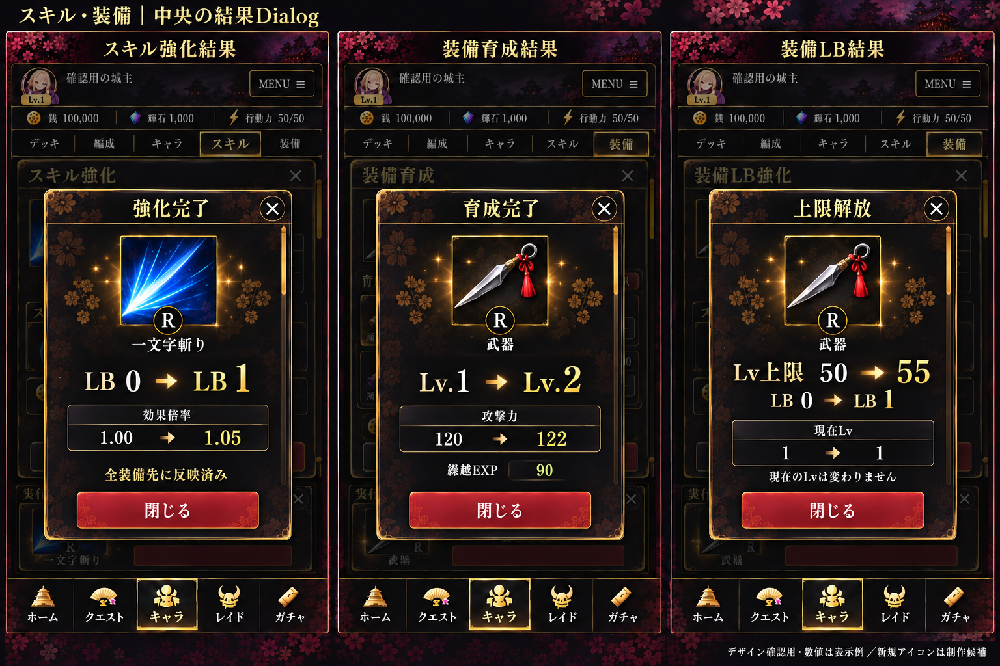

# GAME04 キャラ関連ビジュアルモック

提示画像の保存セット：6枚・19画面。実装・配信の変更は含まない。

## 一覧

|番号|内容|画面数|
|---|---|---|
|1|[キャラ一覧・詳細・詳細下部](01-character-list-detail.png)|3|
|2|[デッキ・編成・スキル・装備](02-deck-formation-skill-equipment.png)|4|
|3|[キャラ育成・覚醒・魂解放：操作前](03-character-growth-actions.png)|3|
|4|[キャラ育成・覚醒・魂解放：中央結果Dialog](04-character-growth-results.png)|3|
|5|[スキルLB・装備Lv・装備LB：操作前](05-skill-equipment-growth-actions.png)|3|
|6|[スキルLB・装備Lv・装備LB：中央結果Dialog](06-skill-equipment-growth-results.png)|3|

## 承認・優先順位

- キャラ部分にユーザーの「問題はない」の承認あり。その後、育成・覚醒・魂解放の下部結果表示は却下され、03・04へ再生成。追加・再生成分をこの保存だけで全件承認済みとはしない。
- 結果を画面下に追加する旧画像は本セットに含めない。操作前と結果は別状態。Dialogは画面中央、閉じる操作を内部に収め、背面を暗転・操作不可とする。
- 共通UI正本と最新ユーザー指示が全画像に優先。数値・所持数は表示例。新規アイコンは制作候補であり正式素材承認ではない。
- これは提示画像を無加工で保存した記録で、全画像の正本適合・実装準備完了を保証するものではない。02の会心率表記はGAME04のCriticalなし仕様に反するため採用不可。01のスキルLv表記は正式LB表記へ照合が必要。06の背面に描かれた旧結果帯は採用不可で、表示する結果Dialogは中央の1つのみ。
- 未承認箇所や画像内の矛盾を実装担当の推測で正式仕様化しない。

## モック画像

### 1. キャラ一覧・詳細・詳細下部

### 2. デッキ・編成・スキル・装備

### 3. キャラ育成・覚醒・魂解放：操作前

### 4. キャラ育成・覚醒・魂解放：中央結果Dialog

### 5. スキルLB・装備Lv・装備LB：操作前

### 6. スキルLB・装備Lv・装備LB：中央結果Dialog

