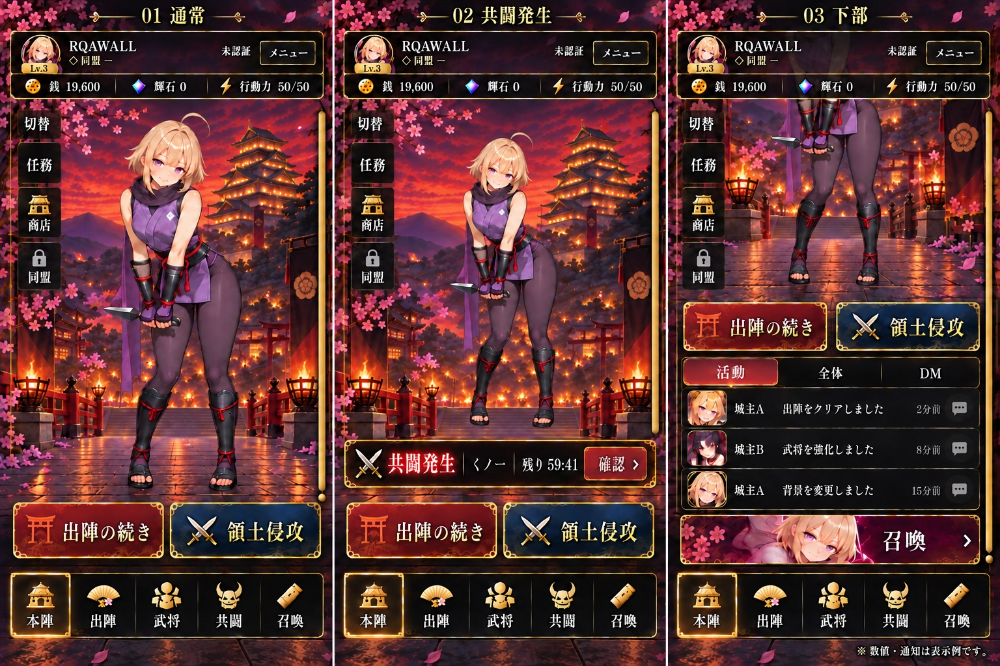
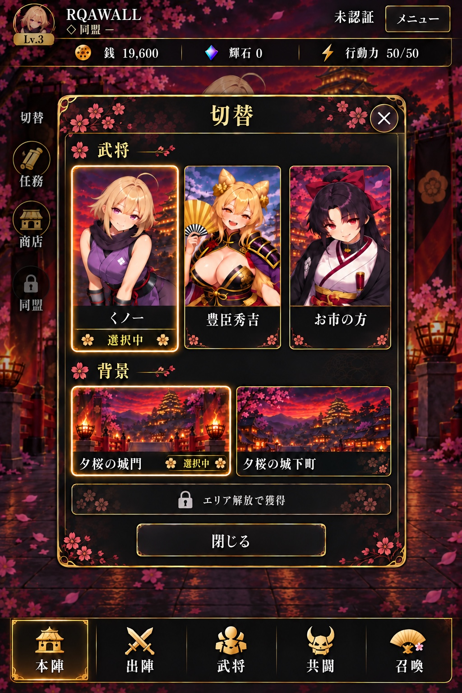

# GAME04 本陣 承認済みビジュアルモック

ユーザー承認済み：2枚・計4状態。実装担当は[確定要件・引き継ぎ](HOME_MOCK_REQUIREMENTS_FIX.md)を併読する。再生成・再設計・承認取り直しは不要。

|画像|対象|
|---|---|
|[01-home-approved.jpeg](01-home-approved.jpeg)|通常／共闘発生／下部表示|
|[02-switch-dialog-approved.jpeg](02-switch-dialog-approved.jpeg)|武将・背景の統合切替Dialog|

原本を保持するため、保存先案のPNGではなく添付と同じJPEG形式で保存。画像加工なし。
先行保存 c5743b172f76e158f4931d4853f81ecc3205e693 の docs/design/mypage/2026-09-23/ と画像内容は同一。本ディレクトリを要件・画像の正式な参照先とする。

## 保存履歴

- 旧要件書：f71a4e4293e16087f6834390e30ba2131459f556。本更新で承認状態とHeaderを訂正。
- 画像2枚の先行保存：c5743b172f76e158f4931d4853f81ecc3205e693。旧引き継ぎの「画像保存未完了」は解消済み。
- 原本01：444AEBD2-0459-4F8B-9CFF-9244B9552A45.jpeg、1536×1024、Git Blob f40e68c4d10c303f1bce78c0543c3235303eb709。
- 原本02：8EB14FA3-FD76-47D3-ADE0-E0A0D83F0020.jpeg、1024×1536、Git Blob ca3ef76eb717ffd8a8fb841aedf43f14dc35b780。

資料保存のみ。実装・Preview配信・Production公開・mainマージは対象外。
実装担当は最新の担当ブランチへ必要資料を取り込み、過去SHAやこの資料保存ブランチ全体で既存成果を上書きしない。

