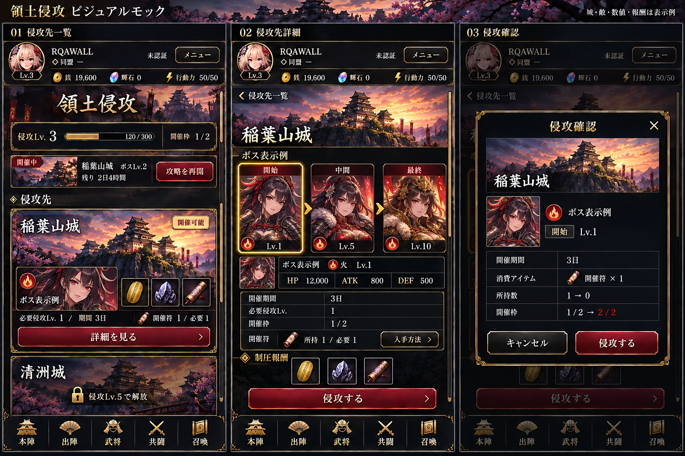

# GAME04 領土侵攻 承認モック・並走実装指示
保存日：2026-09-24。
ユーザーが最新修正版の保存と別スレッド実装起票を指示したセット。

- [モック：侵攻先一覧・詳細・侵攻確認](01-invasion-approved.png)
- [実装指示全文](IMPLEMENTATION_HANDOFF.md)

「侵攻する」統一、敵の開始→中間→最終の視覚的プレビューが最新要件。
城・敵・数値・報酬は表示例。正式Master・既存素材へ接続する。
未決事項で全体を止めず、実装可能範囲を完走し、最後に残件一覧を提出する。

原本PNGを無加工保存。Git Blob：cb32e842d42895f3bd2878361c53c6cc85066b95。
この資料ブランチは実装コードの基準ではない。現行担当Branchへ必要資料のみ取り込み、過去SHAでコードを巻き戻さない。

