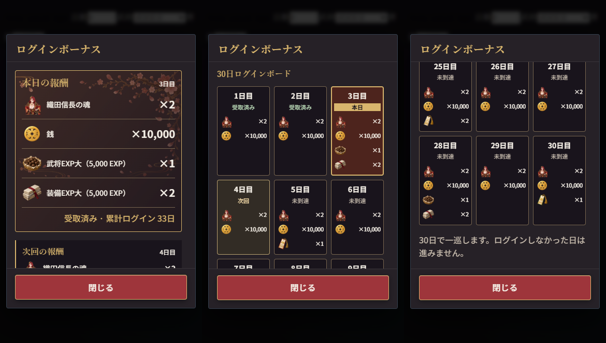

# GAME04 B07 一括レビュー — 構図・ログインボード・背景表示中の演出案

基準：PR #37 / 274d4d7（BURST配信 b7d3420を含む）。2026-09-26。
確定修正と、未承認の背景演出案を分ける。解放時の獲得演出は対象外。

## 確定修正と見本

- DBG-036/037：豊臣の案内場面・本陣武将を頭〜太ももへ。共通CowboyDisplay、60素材の透明余白測定値、素材別切り取り位置を使用。元画像は変更しない。SVGの透明余白にも人物が描画されないよう素材ごとのclipPathを適用し、下端をCTAの上へ揃える。ワールドイントロの複数人物配置は既存のまま。
- 豊臣の表示高は文字送りと独立。112px固定文字領域を維持。本陣は左の操作列と上端装飾の余白を確保し、下の主要CTAへ重ねない。
- DBG-038/039：初期候補は「夕桜の城下街」だけ。旧城門ID/bg_defaultは表示時に城下街へ解決。その他の有効な背景選択を保持。保存データ一括書換え・背景ファイル削除は行わない。
- 一覧は解放済み→未解放。各群内は初期→クエスト進捗→SSR、カテゴリ内は元のマスター順。
- DBG-041：本日の報酬→次回予告→30日ボード。正式マスターの全81報酬行（銭・魂・EXP・召喚券・無償輝石）を表示。累計ログインはcurrent_stepと混同せず、既存total_loginsを表示。
- 受取済み／本日／次回／未到達は文字と色で区別。本日は自動付与済みの受領画面。「受け取る」「マイバッグへ」は追加しない。
- CanonicalDialogの固定タイトル・固定48px CTA・本文だけスクロール、RewardList/NumberUnitを共用。30日目の次回は「次の一巡 · 1日目」、今回の1日目セルは受取済みを保持。

|390px見本|画像|
|---|---|
|豊臣の本陣構図|[本陣](home-char_ageha_01-390.png)|
|豊臣の案内・全文|[チュートリアル](tutorial-390.png)|
|本日4報酬・次回予告|[ログイン上部](login-top-390.png)|
|ボードの4状態・複数報酬|[ボード](login-board-390.png)|
|末尾と固定CTA|[末尾](login-end-390.png)|
|30日目・次の一巡|[30日目](login-day30-390.png)|

375pxの同じ見本と、織田信長・北条氏康・上杉謙信・武田信玄の構図も同フォルダーに保存。

## DBG-040：正式背景別の表示中演出案【提案・未実装】

実素材 `/bg/approved-20260925/quest-*.webp` を目視して作成。単なるエリア名から推測しない。初期の桜背景は現在の桜演出を保持。下記はクエスト解放背景の環境演出であり、背景獲得・解放通知の演出ではない。

|背景（ID）|正式素材で見える情景|表示中の動き案|
|---|---|---|
|三河の地（area:mikawa）|田畑と日当たりのよい街道|遠景上部へ穏やかな光の揺らぎ。道の奥に薄い陽炎|
|尾張の旗（area:owari）|旗の立つ城下への道|旗の周囲を避けた少量の光塵、遠景の淡い霞|
|美濃の城（area:mino）|高所の城郭・石垣・谷|谷側だけをゆっくり流れる薄霧。天守を隠さない|
|近江の湖（area:omi）|青い湖、舟、対岸の城|湖面に疎らな小さい反射光。対岸へ薄い水面霞|
|甲斐の山（area:kai）|岩場の山道と盆地|盆地に低密度の霞が横へ動く。手前の岩・道を保つ|
|越後の雪（area:echigo）|雪原・雪道・山並み|少量の小さな雪片と遠景の淡い雪霞。吹雪にはしない|
|京洛の影（area:kyoto）|夕闇の町並み・灯籠・石畳|灯籠付近に小さな暖色光の明滅、路地奥へ弱い霞|
|出雲の社（area:izumo）|杉林と社・差し込む光|木漏れ日の緩い明暗と少量の光塵。社の形を覆わない|
|薩摩の炎（area:satsuma）|赤い夕空・山・城下の灯|遠景の薄い暖色霞と既存灯付近の弱い明滅。大きな火炎は加えない|
|関ヶ原（area:sekigahara）|暁の野・旗列・遠景の霧|草地の奥へ低い帯状の霧。旗・道筋の判別を維持|
|初期：夕桜の城下街（castle-town）|夕桜・城下|少量の花びら。既存演出を土台に密度を抑える案|

SSR10背景は既存の人物ID別演出を継続。今回、正式背景URLへ更新後に旧URL照合だけでは演出が選ばれない箇所を補正し、同じ既存演出を再接続した。新しいSSR演出は追加していない。

### 全背景共通の提案契約

1. 既存HomeEffectの表示・停止ライフサイクルを共用し、選択背景IDにひも付ける。キャラのレアリティ・解放直後かどうかでは判定しない。
2. 背景画像→環境演出→武将→操作の順。背景の表示領域内でclipし、pointer-events:none。人物・顔・装飾・UIを覆う前景粒子は作らない。
3. 1背景につき1つの演出インスタンス。試作値は花びら/雪/光塵6〜10個、霞1〜2層、8〜16秒の緩い周期を上限の目安とする。値は提案中であり承認済み扱いしない。
4. 背景切替は旧iframeを破棄後に新規生成。同じ背景の再レンダーで多重生成しない。離脱・非表示タブ・reduced-motionでは破棄/停止する。復帰は1つだけ再生成し、経過分を連続再生しない。
5. 新規の大きな動画や画像は追加せず、既存方式の透明iframe/CSS/canvasを共用。新規環境演出のサウンドは付けない。
6. 実装する場合は375/390で各採用パターンの重なりと、切替/離脱/非表示復帰を限定確認。今回はクエスト演出を製品へ接続していないため、その動作を検証済みとはしない。

## 担当・検証・状態

- B07担当：構図部品と補正表、HomeView、IntegratedTutorialの呼出し、home.tsの候補/表示/順序、FormalLoginBonusModal/呼出し、HomeEffectの正式URL接続、共通UI正本§18.9、B07検証資料。
- B03/B06統合担当：PR #37統合push、共通Preview配信、共通台帳の配信SHA更新。2026-09-26に相互連絡し、B07対象に進行中差分なし・並行編集なしを確認。
- CanonicalDialog/Game04DataDisplayの実装本体は変更せず既存APIを利用。戦闘計算・BURST・報酬マスター・累計/付与処理・DB/API・main・本番・GAME03は変更していない。
- ローカル限定確認：375/390×664。5武将の構図、文字送り前後の同一geometry/112px、背景候補/順、ログイン1/3/7/15/30日、全81報酬行、4状態、画像欠落なし、末尾/CTA48px/中央配置/横溢れなし、既存演出の切替/離脱/reduced-motion。
- ドメイン確認：30日分と正式数量一致、城門/旧IDフォールバック、SSR/クエスト解放と安定ソート、未解放保存拒否、保存元非破壊、次の一巡/同日二重付与抑止。既存SSR背景契約もPASS。
- 型検査・production build（ローカルmock設定）成功。既存verify_game04_common_ui.cjsも375/390で成功（検証URLを3017へ、証跡保存先だけB07/common-uiへ変更して実行）。変更部品のESLintはerror 0、既存方針のimg使用warning 1。実データ接続・実機受入は別。共有Previewへ配信されたとはこの資料だけでは扱わない。
- Reactレビュー：Hook順序一定、派生表示のみ、報酬付与の副作用なし、既存画像準備/失敗再試行、iframe破棄、共有Dialogのfocus/スクロールを再利用。
- GAME03原画像は今回の添付ファイルとしては存在せず、提供台帳に記載の情報構造を参照。原画像そのものを今回再閲覧したとは扱わない。

## 統合引渡し用ファイル一覧・台帳記録

製品変更：
- src/app/components/redesign/{HomeView.tsx,HomeEffect.tsx,IntegratedTutorial.tsx,FormalLoginBonusModal.tsx,formalLoginBonus.css,RedesignCommerceOverlays.tsx}
- src/app/components/redesign/visual-bench/{CowboyDisplay.tsx,CowboyDisplay.css}
- src/domain/redesign/home.ts
- src/domain/presentation/formalLoginBoard.ts
- src/theme/character-cowboy-crops.json
- docs/product/GAME04_COMMON_UI_AUTHORITY.md（18.9追記）

検証・資料：src/app/qa/b07（developmentのみ）、scripts/verify_game04_b07.cjs、scripts/verify_game04_b07_domain.cjs、scripts/measure_game04_cowboy_crops.py、本フォルダー。共通台帳本体は統合担当が更新する。

|DBG|本コミットでの状態|備考|
|---|---|---|
|036|修正保存済み・統合配信待ち|豊臣の案内場面、文字送り固定|
|037|修正保存済み・統合配信待ち|共通構図/60素材補正表、5武将限定目視|
|038|修正保存済み・統合配信待ち|城下街のみ、旧城門の表示フォールバック|
|039|修正保存済み・統合配信待ち|解放状態→カテゴリ→安定順|
|040|演出案提示・未実装|表示中の環境演出。獲得演出とは別|
|041|修正保存済み・統合配信待ち|全報酬/状態/累計/末尾/共通CTA|

この表は引渡し時点。配信後は統合担当の共通台帳・配信証拠を優先。ユーザー実機確認前に解決へ変更しない。
