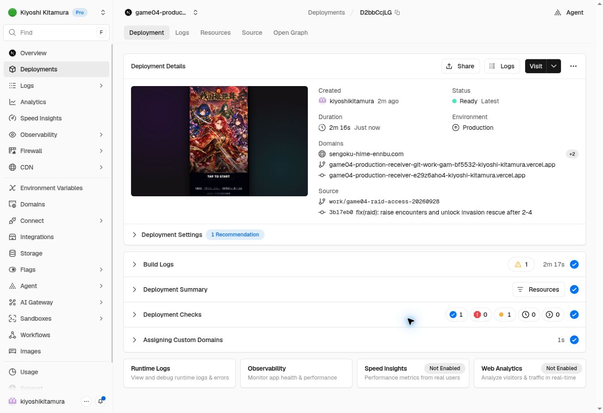

# Raid balance production release — 2026-09-28

User request: raise encounter appearance rates without changing SSR drops; relax invasion rescue participation to clearing 2-4.

- Area 3: 10%; area 4: 15%; area 5: 20%; areas 6–10: 25%. Areas 1–2 unchanged.
- Both invasion rescue join and battle-start checks accept 2-4 clear. Existing 3-5 access remains accepted.
- Invasion hosting stays locked until 3-5 clear.
- SSR boss selection, soul reward probabilities and quantities, and other raid rewards are unchanged.
- Existing quest-start snapshots retain their original values; newly started quests use the new rates.
- Preserves the latest SR/SSR cutins, Maeda recovery, portal, tutorial, and Owari medium-item changes.
- No database migration or live player/test-state writes.

## Code and deployments
Code commit: 3b17eb0c5e34a266543f965da083586588fbf837
Branch: work/game04-raid-access-20260928
Base: 8694a62e423dd8b725712f5a6539060965de6203 (descendant of previous Production 4920d43d726dd91650fa824c9ba8408d87e48c63)
Frontend: https://vercel.com/kiyoshi-kitamura/game04-production-receiver/D2bbCcjLG8ycPCHdqj6bywxq8sqk
Public domain: https://sengoku-hime-ennbu.com/
Backend: game04-redesign-api v9 ACTIVE, JWT verification retained.
Generated source SHA-256: 8e0c8a9668997cbe0e4c662604f191a2180d374e6efc6a52f60e2a4c680c14d2
Deployed ezbr SHA-256: 202f225f141f289c93de2e8835631c7c281a62f51873805b9704d6815cdddc09

## Validation
- VERCEL_ENV=preview npm run check: PASS (typecheck and build).
- Final npm run typecheck after adding regression fixture: PASS.
- scripts/verify_game04_raid_rescue_20260928.ts: eight actual bundled-handler scenarios PASS; join and battle-start reject no-clear/2-3, accept 2-4/3-5 through the commit boundary with a mocked database.
- Hosting helper remains false at 2-4 and true at 3-5.
- Master comparison: exactly 22 encounterChance fields changed; all other quest fields preserved. Raid rarity/soul reward masters unchanged.
- Production backend version checked after deployment: v9 ACTIVE.
- Frontend Production Ready; public HTML reports dpl_D2bbCcjLG8ycPCHdqj6bywxq8sqk.
- Downloaded public initial bundles: all 68 quest stage definitions found; areas 3/4/5/6+ match 10/15/20/25%.

