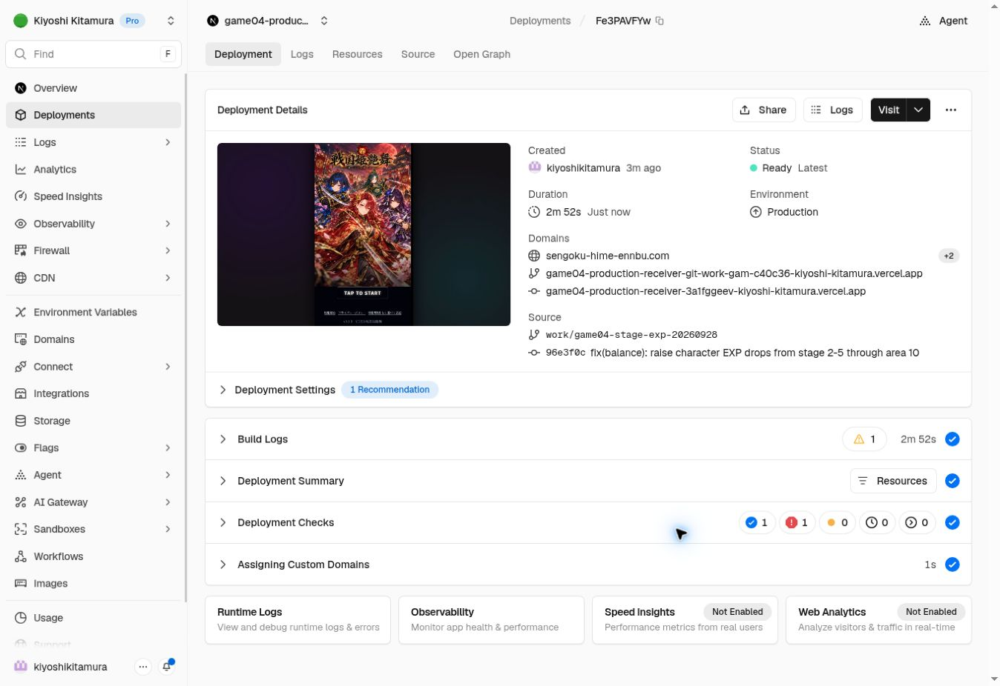

# Character EXP drop increase — 2026-09-28
User approved Production at 19:05 JST.

| Stages | Character EXP per clear | Items |
|---|---:|---|
| 2-3 / 2-4 | 1000 (retained) | medium x1 |
| 2-5 and area 3 | 2000 | medium x2 |
| Area 4 | 3000 | medium x3 |
| Area 5 | 4000 | medium x4 |
| Area 6 | 5000 | large x1 |
| Area 7 | 6000 | large x1 + medium x1 |
| Area 8 | 7000 | large x1 + medium x2 |
| Area 9 | 8000 | large x1 + medium x3 |
| Area 10 | 10000 | large x2 |

59 stage reward arrays changed. Other stages retained.
Only normal character EXP rewards changed. Enemy stats, equipment EXP, cash, first-clear rewards, souls, encounter rates, rescue access, and cutins are preserved.
Earlier DEF/weapon proposals are NOT included.
Quests started before release retain their saved reward snapshots.

Code: 96e3f0c1b1d87a0df7561afadf78d268001787b5
Base: 22fd96841b7c132a80904eafaaee8fee19c42659
Branch: work/game04-stage-exp-20260928
Production: https://vercel.com/kiyoshi-kitamura/game04-production-receiver/Fe3PAVFYwHuLfyWhydzSAWyhK9HV
Backend: game04-redesign-api v10 ACTIVE, verify_jwt=true
Bundle SHA256: c17af08c5ce6cd4e521a0436f9629e540e4d0beb0846dc916ccf0c85e970a42b
Deployed ezbr SHA256: 90e8e77d27039e1b9408c682a400a228955074f3d912efc554e3d97af26402fc

Validation:
- Compared all stage definitions against base: only normal character EXP rewards changed.
- Typecheck PASS.
- Production build with VERCEL_ENV=preview PASS. Initial worktree symlink limitation resolved by copying node_modules.
- git diff --check PASS.
- Local tree and saved GitHub tree identical: 33624ede8a8c89fb9bfe6c980c1996cb38a085c5.
- Frontend Production Ready; public deployment dpl_Fe3PAVFYwHuLfyWhydzSAWyhK9HV.
- All 68 public quest reward arrays match local approved master. Enemy-data raw comparison only showed floating-point serialization differences (~1e-15) in passive percentages; HP/ATK/DEF and other values match.
- Vercel TypeCheck passed; repository-wide Lint check reports 954 errors / 2561 warnings. This release changes only quest JSON and generated API output; no broad lint cleanup was attempted.
- Published news 20260928180953 appended exact line: ・各ステージの報酬ドロップを変更
- Verified news visibility under authenticated role. Existing title, introduction, and three prior bullets retained.

